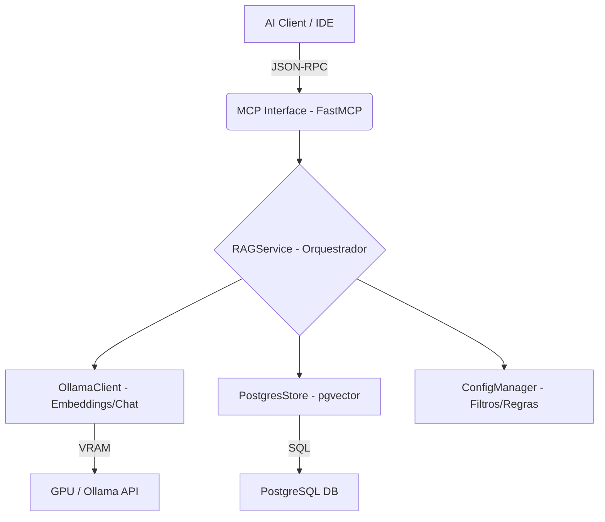

# Arquitetura do Sistema: MCP Rust Star Knowledge Server

Este documento descreve a organização interna, os padrões de design e a topologia de componentes do servidor de conhecimento RAG.

## 1. Visão Geral da Topologia

O sistema segue uma arquitetura de **Camadas Desacopladas**, garantindo que a interface de comunicação (MCP) não dependa diretamente da implementação específica do banco de dados ou do cliente de LLM.

## 2. Camada de Interface (MCP)

A camada de interface é construída sobre o framework `FastMCP`. Ela atua como a borda do sistema, convertendo as requisições JSON-RPC em chamadas de método Python.

### Padrão de Decoração e Logging
Todas as ferramentas MCP são decoradas com `@mcp_tool_with_logging`. Este decorator não apenas registra a função no protocolo MCP, mas também injeta:
- **Heartbeat de Execução**: Registra o início e o fim da ferramenta no `mcp_error.log`.
- **Captura de Exceções**: Garante que qualquer erro no Python seja convertido em uma mensagem de erro JSON-RPC válida, acompanhada de um traceback completo no log de erro.

### Ferramentas de Background
Devido à natureza demorada da indexação (que pode durar horas), o MCP utiliza o `asyncio.create_task` para disparar processos de "Batch Indexing" em segundo plano. Isso permite que o servidor continue respondendo a consultas RAG enquanto a indexação ocorre.

## 3. O Orquestrador (RAGService)

O `RAGService` é a "Single Source of Truth" (Fonte Única de Verdade) do sistema. Ele é responsável por:

- **Gerenciamento de Estado**: Mantém o objeto `self.state` que alimenta o Dashboard em tempo real.
- **Fluxo de Dados**: Coordena a leitura de arquivos, o fatiamento (chunking) e o envio para o banco de dados.
- **Resiliência**: Implementa a lógica de subdivisão de fragmentos quando o Ollama reporta falhas de memória ou timeout.

### Padrão de Singleton
No `main.py`, uma única instância de `RAGService` é criada no início do ciclo de vida do servidor e compartilhada entre todas as ferramentas. Isso garante que os contadores de estatísticas (Novos, Cache, Ignorados) sejam consistentes e centralizados.

---

## 4. Pipeline de Ingestão de Dados

A ingestão de dados é o processo mais crítico do sistema, onde o código fonte é transformado em fragmentos (chunks) e depois em vetores.

### 4.1. Descoberta e Filtragem (Crawler)
O processo de descoberta utiliza um `os.walk` customizado que interage com o `ConfigManager`. 
- **Poda de Árvore (Pruning)**: O crawler realiza a poda de diretórios in-place (`dirs[:] = [...]`) baseando-se em padrões do `.gitignore` e pastas ocultas. Isso reduz drasticamente o I/O em pastas como `.git`, `node_modules` e `target`.
- **Whitelist de Engenharia**: Diferente de buscadores genéricos, este sistema foca em arquivos com semântica de código ou configuração (`.rs`, `.lua`, `.cpp`, `.otmod`, `.xml`). Arquivos binários ou assets são descartados na borda para evitar ruído na base de conhecimento.

### 4.2. Fatiamento Semântico e Recursivo (Chunking)
O sistema utiliza o `RecursiveCharacterTextSplitter` com separadores específicos por linguagem:
- **Prioridade de Quebra**: O sistema tenta quebrar o código primeiro em definições de funções (`function`, `fn`, `impl`), depois em parágrafos (`\n\n`), linhas e, por último, espaços.
- **Tamanho Dinâmico**: Configurado por padrão para 12.000 caracteres com 1.000 de sobreposição (overlap), garantindo que o contexto das funções seja preservado entre fragmentos adjacentes.

### 4.3. Resiliência por Subdivisão (Recursive Subdivision)
Um dos diferenciais deste pipeline é a capacidade de lidar com arquivos que excedem o limite de contexto do modelo de embedding ou saturam a VRAM.
1. **Tentativa Inicial**: O fragmento é enviado para o Ollama.
2. **Fallback em Falha**: Se ocorrer um erro (timeout ou memória), o sistema divide o fragmento em 4 sub-pedaços menores e tenta indexá-los individualmente.
3. **Persistência de Sub-fragmentos**: Estes sub-pedaços são marcados com metadados `sub_chunk`, permitindo que o RAG os recupere como partes de uma unidade maior.

## 5. Garantia de Integridade (MD5 Hashing)

Para evitar re-indexação desnecessária e economizar ciclos de GPU, cada arquivo processado gera um hash MD5 do seu conteúdo.
- **Cache Hit**: Antes de qualquer processamento pesado, o `PostgresStore` verifica se o hash já existe para aquele `project_id`.
- **Atualização Incremental**: Se o conteúdo do arquivo mudar, o hash mudará, disparando uma nova indexação e garantindo que a base de conhecimento esteja sempre sincronizada com o código atual.

---

## 6. Camada de Persistência Vetorial (Postgres + pgvector)

A escolha do **PostgreSQL** com a extensão **pgvector** como motor de busca não foi acidental. Diferente de bancos vetoriais puramente em memória, esta solução oferece persistência ACID e escalabilidade industrial.

### 6.1. Isolamento por Projeto (Multi-Tenancy)
Para garantir que o contexto de um projeto (ex: `FoxClient`) não "polua" as respostas de outro (ex: `FoxOT`), o sistema utiliza um padrão de tabelas isoladas:
- Cada projeto possui sua própria tabela no banco de dados, seguindo o padrão `knowledge_[project_id]`.
- Isso permite a execução de operações de **VACUUM** e **REINDEX** de forma independente, além de facilitar a limpeza completa de um projeto (`clear_knowledge_base`) sem afetar os outros.

### 6.2. Estrutura do Documento Vetorial
Cada linha na tabela de conhecimento representa um fragmento de código e contém:
- `id`: UUID único do fragmento.
- `content`: O texto bruto do código/configuração.
- `metadata`: JSONB contendo o caminho do arquivo (`source`), hashes e flags de subdivisão.
- `embedding`: O vetor numérico (gerado pelo modelo `qwen3-embedding`) que representa a semântica do texto.

### 6.3. Algoritmo de Busca e Rankings
A recuperação de informações (Retrieval) utiliza a **Similaridade de Cosseno** (operador `<=>` no pgvector).
1. **Query Embedding**: A pergunta do usuário é convertida em um vetor.
2. **Busca por Similaridade**: O Postgres realiza o cálculo de distância entre o vetor da pergunta e todos os vetores da tabela do projeto.
3. **Re-ranking**: Os resultados são ordenados do mais próximo ao mais distante, e apenas os `top-N` fragmentos mais relevantes são enviados ao LLM como contexto.

## 7. Eficiência de Memória e VRAM

O sistema foi otimizado para rodar em hardware de consumidor (NVIDIA RTX).
- **Ejeção de Modelos**: Após grandes operações de indexação, o servidor solicita ao Ollama o `unload` dos modelos da VRAM. Isso evita que a memória de vídeo fique "presa", permitindo que o usuário utilize a GPU para outras tarefas (como rodar o cliente do jogo ou ferramentas de design) sem lentidão.
- **Batched Inserts**: Os fragmentos não são gravados um a um, mas sim em lotes, reduzindo o overhead de transações SQL.

---

## 8. Monitoramento e Diagnóstico (Dashboard)

A transparência é um princípio fundamental deste servidor. Para evitar que o processo de indexação seja uma "caixa preta", implementamos um sistema de telemetria em tempo real.

### 8.1. Ponte de Estado (Shared State)
Como o servidor MCP e o Dashboard rodam em processos separados, a comunicação é feita através de um arquivo de estado compartilhado (`data/current_indexing.json`).
- O `RAGService` atualiza este arquivo a cada arquivo processado ou fragmento gerado.
- O Dashboard realiza um "polling" assíncrono (4 vezes por segundo), garantindo uma latência visual mínima sem sobrecarregar o disco.

### 8.2. Interface Terminal de Elite (Rich)
O Dashboard utiliza a biblioteca `rich` para criar uma interface visual densa no terminal:
- **Painel de Estado**: Exibe o projeto ativo, o arquivo atual e contadores de performance (Novos vs Cache).
- **Terminal de Eventos**: Renderiza os logs do sistema com cores semânticas (Vermelho para Erros, Azul para Debug). Isso é possível porque o Dashboard lê diretamente o fluxo do `mcp_error.log`.

### 8.3. Protocolo de Logging (JSON-RPC Compliance)
Uma restrição crítica do protocolo MCP é que o `stdout` deve ser reservado exclusivamente para mensagens JSON-RPC. 
- **Stderr redirection**: Todos os logs e erros do sistema são redirecionados para o `stderr` ou para arquivos físicos.
- **CustomLogger**: Implementamos um logger que garante que nenhuma mensagem de texto "vaze" para o canal de dados da IDE, o que causaria a desconexão imediata do servidor.

## 9. Conclusão

O **MCP Rust Star Knowledge Server** evoluiu de um simples integrador RAG para uma infraestrutura robusta de conhecimento. A combinação de persistência industrial (Postgres), resiliência de memória (Subdivisão de Chunks) e transparência operacional (Dashboard) o torna uma ferramenta indispensável para o desenvolvimento de grandes ecossistemas de código.

---
*Fim da Documentação de Arquitetura - Versão 1.0*
